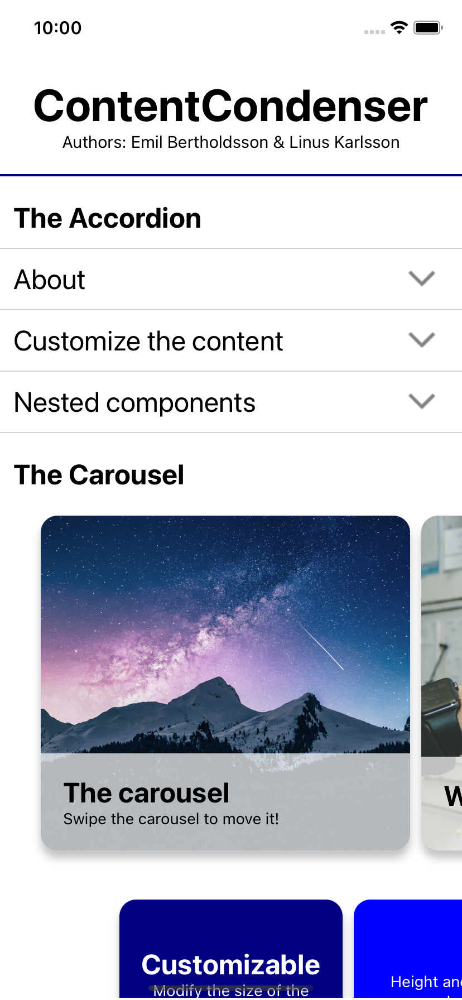

# ContentCondenser 📁

ContentCondenser is a navigation component library that includes an accordion menu and a carousel content viewer for react-native. 


## Getting Started

### Dependencies

* A React Native project installed and ready to go!
* Node version 16 or above

### Installing

* Download the repos components folder and add it to your project files

* Import the components into your project!
```jsx
import Carousel from './Components/Carousel';
import Accordion from './Components/Accordion';
```
## Accordion 🪗
In many cases, content can be organized in sections and subsections. For such cases, accordion menues are handy as a way to condense an otherwise very large list.  
### Using the Accordion
The **items** prop defines the titles and content of the accordion. To create an accordion menu, provide a string as the title, and any component tree as the content. 

Example of a simple accordion component containing only two items:
```jsx
<Accordion
    items={
        {
            title:"First item",
            content:<Text>All your elements here!</Text>
        },
        {
            title:"Second item",
            content:
            <Text>Got more elements? Put them here for the next tab!</Text>
        }
    }
/>
```

The accordion component includes a few settings you can use to make it look the way you want it to! The different settings are:
* **numbered**: Boolean value. If true, the titles of each item in the accordion menu become numbered (this is **false** by default).
* **textStyle**: Stylesheet for custom styling of the text in each menu item. Adds to the predefined styling. 
* **containerStyle**: Stylesheet for the pressable container for each menu item. Adds to the predfined styling. 

Example of setting the settings props:
```jsx
<Accordion
    items={...}
    numbered={true}                   // Displays numbers with every title
    textStyle={styles.text}           // The style of your titles!
    containerStyle={styles.container} // The style of the containers! 
/>
```

## Carousel 🎠
A carousel displays a subset of items in in a horizontal format. By displaying the content this way, individual content is given more attention than if everything is shown at once.

### Using the Carousel
The carousel component is a component that wraps around content, splitting it into swipeable slides arranged in a horizontal manner. The content is split by child, meaning that only direct children of the carousel become a new slide. If you nest components as you would when you usually build a page, these will be contained within one slide.

Here is a simple example of the carousel:
```jsx
<Carousel>
    <Text>This is the first slide!</Text>
    <Text>This is the second slide!</Text>
    <View style = {styles.view}>               
        <Text>This is the content of a view, which is the third slide!</Text>
    </View>
</Carousel>
```
The carousel component includes settings for width and height as well.
* **width**: Default value is 80% of the screen width.
* **height**: Default value is 70% of the screen width. 

An example of setting width and height for the carousel:
```jsx
<Carousel width={150} height={150}>
    //...
</Carousel>
```

*A tip!*, Define a card design component and use it as your carousel content!
```jsx
const Card = ({image, title, desc}) => {
    return(
        <ImageBackground source={image} style={styles.bgImage}>
            <View style={styles.view}>
                <Text style={styles.title}>{title}</Text>
            </View>
        </ImageBackground>
    )
}

<Carousel height={200}>
    <Card image={eleph} title="Elephant"/>
    <Card image={rhino} title="Rhinoceros"/>
    <Card image={hippo} title="Hippopotomonstrosesquippedaliophobia"/>
</Carousel>
```

## Demo
A demonstration of the components usage is available in the file **App.js**. 


## Authors

Emil Bertholdsson [github/EmilBert](https://github.com/EmilBert) \
Linus Karlsson [github/Linnet5](https://github.com/Linnet5)

## Acknowledgments
* [(React Native) Create a Horizontal Snap ScrollView](https://medium.com/nerd-for-tech/react-native-create-a-horizontal-snap-scrollview-e1d01ac3ba09)